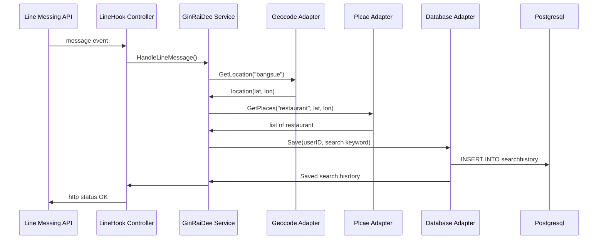

# GinRaiDee

Restaurant finder service provide:

 - Line chatbot integration
 - RESTFul provide restaurant information

## Line chatbot integration

Become friend with `@389weezk` and then you can just type in area name linebot will give some interesting restaurants on that area.

## RESTFul provide restaurant information

Provide endpoint to list restaurant information by given address/area.

    GET https://ginraidee.herokuapp.com/v1/restaurants?address=bangsue

## Architecture

- **controller layer**: handle http request from outside
		- linehook controller: handle webhook call made by line messaging api when user send message to chatbot
		- restaurant controller: handle call  made by client to RESTFul api to get restaurant information 
- **service layer**: handle business logic
- **adapter/repository layer**: make call to external service to retrieve information
		- line message adapter: handle communication with line API
		- google geocode adapter: ask for coordinate (lat, lon) by given area name
		- google place api: ask for place with specific type(restaurant in this case) by 	given coordinate
		- database adapter: handle communication with data store to store user search history

## Sequence diagrams

Sequence diagram show how chatbot service interact with line messaging API, Google place API and aatabase

